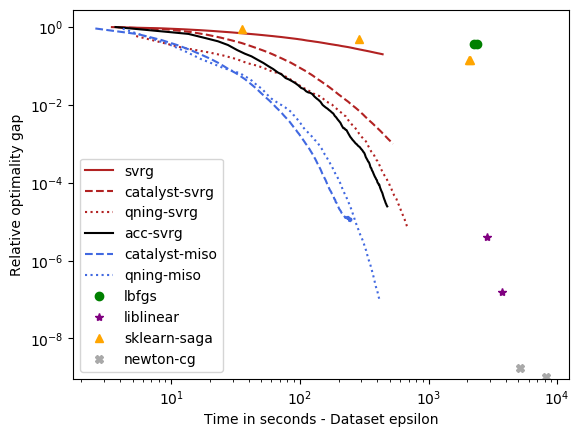
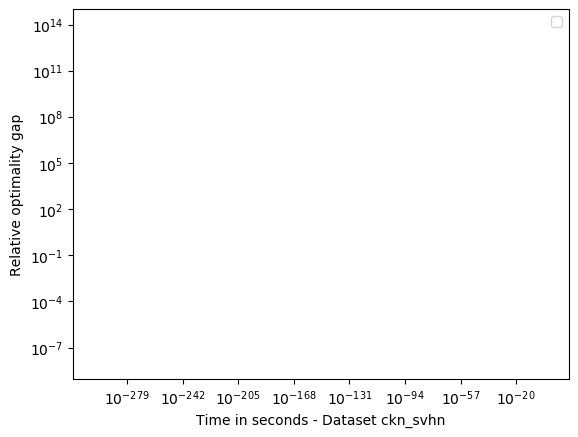

Benchmarks
==========

We consider the problem of :math:`\ell_2`-logistic regression for binary
classification, or multinomial logistic regression if multiple classes are
present. 

Datasets
--------
We will present the results obtained by the solvers of Arsenic on 11
datasets, presented in the Table below. The 9 first datasets can be found on the
`LIBSVM dataset web-page <https://www.csie.ntu.edu.tw/~cjlin/libsvmtools/datasets/>`_.
The last two datasets were generated by encoding the `MNIST <http://yann.lecun.com/exdb/mnist/>`_ and `SVHN <http://ufldl.stanford.edu/housenumbers/>`_ datasets with a two-layer `convolutional kernel network (CKN) <https://hal.inria.fr/hal-01387399/document> (NIPS'16)`_.
All datasets samples are normalized with :math:`\ell_2`-norm and centered for dense datasets.

+------------+------------+--------------+-------------+-----------+--------------+
| Dataset    | Sparse     | Num classes  | n           | p         | Size (in Gb) |
+============+============+==============+=============+===========+==============+
| covtype    | No         | 1            | 581012      | 54        | 0.25         |
+------------+------------+--------------+-------------+-----------+--------------+
| alpha      | No         | 1            | 500000      | 500       | 2            |
+------------+------------+--------------+-------------+-----------+--------------+
| real-sim   | No         | 1            | 72309       | 20958     | 0.044        |
+------------+------------+--------------+-------------+-----------+--------------+
| epsilon    | No         | 1            | 250000      | 2000      | 4            |
+------------+------------+--------------+-------------+-----------+--------------+
| ocr        | No         | 1            | 2500000     | 1155      | 23.1         |
+------------+------------+--------------+-------------+-----------+--------------+
| rcv1       | Yes        | 1            | 781265      | 47152     | 0.95         |
+------------+------------+--------------+-------------+-----------+--------------+
| webspam    | Yes        | 1            | 250000      | 16609143  | 14.95        |
+------------+------------+--------------+-------------+-----------+--------------+
| kddb       | Yes        | 1            | 19264097    | 28875157  | 6.9          |
+------------+------------+--------------+-------------+-----------+--------------+
| criteo     | Yes        | 1            | 45840617    | 999999    | 21           |
+------------+------------+--------------+-------------+-----------+--------------+
| ckn_mnist  | No         | 10           | 60000       |   2304    | 0.55         |
+------------+------------+--------------+-------------+-----------+--------------+
| ckn_svhn   | No         | 10           | 604388      |  18432    | 89           |
+------------+------------+--------------+-------------+-----------+--------------+

Protocol
--------
To select a reasonable regularization parameter :math:`\lambda_1` for each dataset, we first split each dataset into 80% training and 20% validation, and select the optimal parameter from a logarithmic grid :math:`2^{-i}/n` with :math:`i=1,\ldots,16` when evaluating trained model on the validation set. Then, we keep the optimal parameter :math:`\lambda_1`, merge training and validation sets and report the objective function values in terms of CPU time for various solvers. The CPU time is reported when running the different methods on an Intel(R) Xeon(R) Gold 6130 CPU @ 2.10GHz with 128Gb of memory (in order to be able to handle the ckn_svhn dataset), limiting the maximum number of cores to 8. Note that most solvers of Arsenic are sequential algorithms that do not exploit multi-core capabilities. Those are nevertheless exploited by the Intel MKL library that we use for dense matrices. Gains with multiple cores are mostly noticeable for the methods ista, fista, and qning-ista, which are able to exploit BLAS3 (matrix-matrix multiplication) instructions.

In the evaluation, we include solvers that can be called from scikit-learn, such as Liblinear, LBFGS, newton-cg, or the saga implementation of scikit-learn. We run each solver with different tolerance parameter tol=0.1,0.01,0.001,0.0001 in order to obtain several points illustrating their accuracy-speed trade-off. Each method is run for at most 500 epochs.

Results
-------
The results are presented below. There are 11 datasets, and we are going to
group them into categories leading to similar conclusions. We start with those
requiring a small regularization parameter (e.g., :math:`\lambda_1=1/(100n)`),
which lead more difficult optimization problems since there is less strong
convexity.

.. note:
I am well aware of the limitations of this study (single runs, lack of error bars) and I will try to
improve it when time permits. Yet, the conclusions seem robust enough given the number of methods and 
datasets.

small :math:`\lambda_1`: covtype, epsilon, webspam, ckn_mnist
^^^^^^^^^^^^^^^^^^^^^^^^^^^^^^^^^^^^^^^^^^^^^^^^^^^^^^^^^^^
For these datasets, regularization is important, but not crucial to achieve
a good predictive accuracy and thus the optimal :math:`\lambda_1` is small. For
instance, for ckn_mnist, the accuracy on test data is typically above 99\%, and
the dimension p for covtype is so small that regularization is useless. 
This leads to an interesting setting with clear conclusions.

Conclusions
 - **qning and catalyst accelerations are very useful**. Note that catalyst works well in practice both for svrg and miso (regular miso, not shown on the plots, is an order of magnitude slower than its accelerated variants). This is in contrast with the message seen in some recent publications that catalyst is theoretically appealing but not practical. While this may be true for the first variant of Catalyst that required checking optimality conditions with duality in an inner-loop, the variant we use from [CATALYST]_ is much simpler. 
   Then, if you are about to propagate such a message, try Arsenic before!
 - **qning-miso and catalyst-miso are the best solvers here**, better than svrg variants. The main reason is the fact that for t iterations, svrg computes 3t gradients, vs. only t for the miso algorithms. miso also better handle sparse matrices (no need to code lazy update strategies, which can be painful to implement).
 - **Arsenic does much better than sklearn-saga, liblinear, and lbfgs**. Note that sklearn-saga does as bad as our regular srvg solver.
 - direct acceleration (acc-svrg) works a bit better than catalyst-svrg: in fact acc-svrg is close to qning-svrg here.

.. figure:: figs/covtype_logistic_l2.png

.. figure:: figs/webspam_logistic_l2.png

.. figure:: figs/ckn_mnist_logistic_l2.png

other category
^^^^^^^^^^^^^^

.. figure:: figs/alpha_logistic_l2.png

.. figure:: figs/real-sim_logistic_l2.png

.. figure:: figs/ocr_logistic_l2.png

.. figure:: figs/rcv1_logistic_l2.png

.. figure:: figs/kddb_logistic_l2.png

.. figure:: figs/criteo_logistic_l2.png

